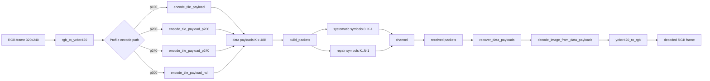
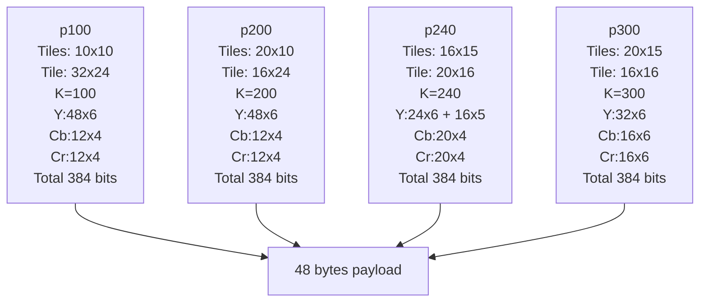
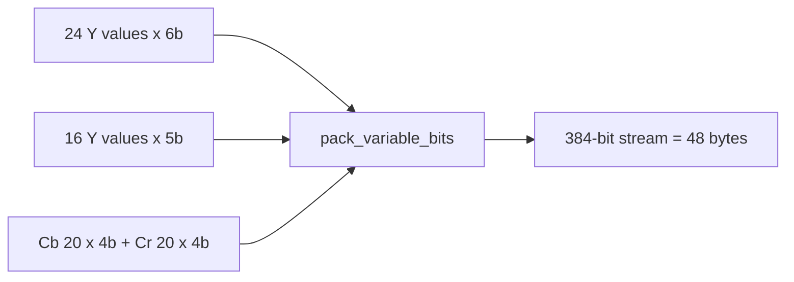
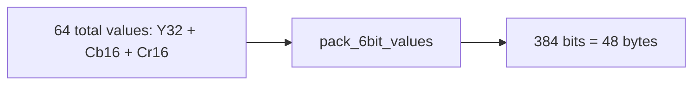
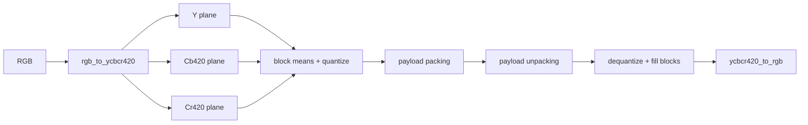

# MeshCam Codec Diagrams

This is a visual companion to `codec.md`.
It explains the same codec using flow diagrams and compact layouts.

## 1. End-to-End Dataflow



## 2. Profile Geometry and Bit Budget



## 3. Payload Layouts

### p100 / p200 fixed layout

- bytes `0..35`: luma indices
- bytes `36..41`: Cb indices
- bytes `42..47`: Cr indices

```text
|<------------------------- 48 bytes -------------------------->|
| bytes 0..35 (Y) | bytes 36..41 (Cb) | bytes 42..47 (Cr) |
```

### p240 variable-bit stream



### p300 uniform 6-bit stream



## 4. Packet Record Layout

Each dumped packet record is 58 bytes:

- 10-byte header
- 48-byte payload

```text
Byte 0   : flags (bit0 = is_repair)
Byte 1   : header version (1)
Byte 2-3 : frame_id (big-endian)
Byte 4-5 : symbol_id (big-endian)
Byte 6-7 : k_data (big-endian)
Byte 8-9 : n_total (big-endian)
Byte 10+ : payload[48]
```

## 5. Repair Symbol Construction

```mermaid
flowchart TD
    A[frame_id, symbol_id, k_data, coeff_seed] --> B[coefficient_row]
    B --> C{symbol_id < k_data?}
    C -->|yes| D[one-hot row]
    C -->|no| E[deterministic random row in GF(256)]
    E --> F{all zeros?}
    F -->|yes| G[force one coeff to 1]
    F -->|no| H[use row as-is]
    D --> I[combine_data_payloads]
    G --> I
    H --> I
    I --> J[repair payload (48B)]
```

## 6. Decoder Recovery (Linear Solve)

```mermaid
flowchart TD
    A[received packets] --> B[fill known data payload slots]
    B --> C[find missing data symbol IDs]
    C --> D[build reduced linear system over missing symbols]
    D --> E[solve_full_rank over GF(256)]
    E --> F{full rank?}
    F -->|yes| G[recover all missing payloads]
    F -->|no| H[partial/failed recovery]
    G --> I[decode_image_from_data_payloads]
    H --> I
    I --> J{conceal_missing?}
    J -->|yes| K[nearest_known_sources BFS copy]
    J -->|no| L[leave neutral tiles]
    K --> M[ycbcr420_to_rgb]
    L --> M
    M --> N[decoded RGB]
```

## 7. Color Path Detail



## 8. Where Code Lives

- Codec/FEC core: `meshcam_codec.py`
- Simulation helpers (loss, PSNR/MSE, diff image): `meshcam_codec_sim.py`
- Deep narrative explanation: `codec.md`

